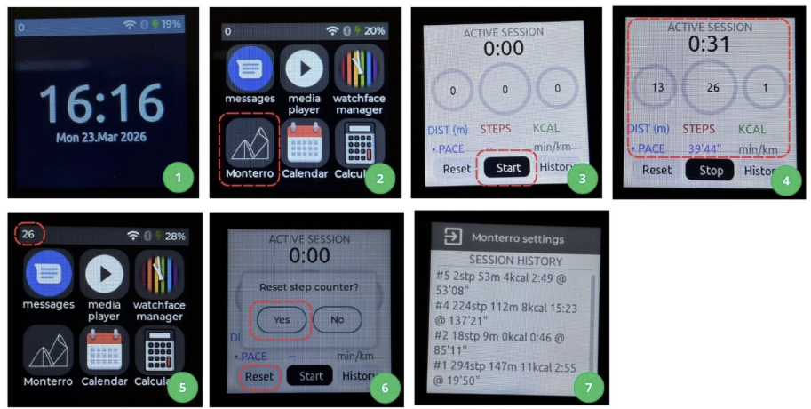

1. Introduction 

1.1 Product Description and Purpose 

This project, Monterro, uses the LILYGO T-Watch-2020 as a smart hiking assistant designed for hiking and trail activities with Raspberry Pi 400 as a data processing and web server unit. The watch displays the user's live statistics, including step counter, step-to-distance counter, number of calories burned, pace, and route records history with line graph visualization. The watch firmware was built on PlatformIO and LVGL. This data is synchronized to Raspberry Pi via Bluetooth Low Energy (BLE) and/or Wi-Fi, then it is displayed on a Monterro web dashboard that can be accessible from any browser on the local network. 

1.2 Product Features 

 *Counted step is displayed as real-time data on the watch screen 
 *Automatic distance conversion from steps to distance in meters (and kilometers) 
 *Calories burned calculation based on the steps and distances taken 
 *Session history saved on Raspberry Pi and displayed on the live web dashboard as a line diagram 
 *Web dashboard that displayed real-time updated data and last session history 
 *Data synchronization via Bluetooth Low Energy (main channel) 
 *Data synchronization via Wi-Fi HTTP POST 

2. What to Prepare Before Starting 

2.1 Hardware 

Mandatory hardware to prepare before starting: 
 *LilyGo T-Watch 2020 V2 
 *Raspberry Pi 400 with power adapter, SD card, and HDMI cable 
 *USB cable (USB-A to micro-USB) 
 *Wi-Fi router, ensure that both devices connected to the same local network 

2.2 Software 

Before running the system, put both Raspberry Pi and watch on the same Wi-Fi connection. BLE will be automatically connected when you pair the Raspberry Pi and the watch or verify with:  

bluetoothctl scan on 

It can be verified that the Raspberry Pi already connected with the watch if watch MAC address appears 08:3A:F2:69:AA:96. 

To connect to the website backend server, run this command: 

home/YOUR_RASPBERRYPI_USER/YOUR_FILE_NAME/python3 server.py 

2.3 Dashboard 

If you want to see the updates on Monterro website, go to this website and create your account. The website will direct you automatically to the dashboard. The same data will be displayed on both watch and website: https://monterro.vercel.app/ 

3. Using the Watch

1. Watch home screen, swipe left to find the menu screen 
2. Menu screen, the Hiking Tour Assistant can be found by pressing the “Monterro” app 
3. Press “Start” to start the hiking session.  
4. You will see the “Active Session” duration is counting along with the distance, steps, and calories burned 
5. When you are no longer opening the Monterro app, the steps update is shown on the upper toolbar 
6. Press “Reset” to reset the counter back to 0, then press “Yes” 
7. You can also press the “History” button to see your last routes data. Then press the exit icon in the upper-left side of the screen 

3.1 Turning the Watch ON and OFF 
 *Hold the crown (side button) for 2 seconds to turn the watch on 
 *Hold the crown for 2 seconds to turn the watch off 

3.2 Watch Navigation 

You can use the watch using a swipe and tap gesture.

| Gesture     | Action                    |
|-------------|---------------------------|
| Tap         | Confirm or select button  |
| Swipe Right | Go to next screen         |
| Swipe Left  | Go to previous screen     |
| Swipe Down  | Open control center       |

3.3 Starting a Session 

The following are the steps to record your activity via Monterro watch app 
 *Swipe left from the clock screen to find the Monterro watch app (bottom left) 
 *Tap the START button 
 *The duration will start to count up (in seconds unit) 
 *You will see STEPS, DISTANCE (km), and DURATION counting in real time, along with the conversion to CALORIES (kcal) and PACE 
 *Start hiking and the watch records your steps automatically via the built-in accelerometer 

3.4 Activity Guide

| Displayed Variable | Description |
|--------------------|-------------|
| STEPS | Total steps taken in the session |
| DISTANCES | Converted steps to meters or kilometers |
| CALORIES | Converted steps to kcal |
| DURATION | Time elapsed since START button is pressed (MM:SS) |
| PACE | How long is your pace to reach one kilometer |
 
3.5 Stopping a Session 

The following are the steps to stop your recording via Monterro watch app 
 *Tap the red STOP button on the Monterro app 
 *Final session data (steps, distance, duration) is sent to the Raspberry Pi 
 *The Raspberry Pi calculates calories burned and saves the session 
 *The dashboard updates with the complete session summary 
 
3.6 Resetting the Step Counter  

The following are the steps to reset your recording via Monterro watch app 
 *Tap the RESET button on the Monterro screen 
 *Tap Yes to confirm in the notification dialog 
 *All session counters reset to zero 
 *As long as you are not pressing STOP, the recording will still be ongoing even though you are no longer opening the application 

4. Website Dashboard

4.1 Landing Page 

1. Home page/landing page
2. Navigate to dashboard page
3. Navigate (auto-scroll) to sign-up page 
4. Get started button: Navigate (auto-scroll) to log in
5. Log in page
6. Create account: changes the page to sign-up page

The Monterro website’s landing page shows a welcoming message along with the log in or sign-up message. When you press “Get Started” button, it will direct you to auto-scroll to the log in button with an option to create an account. After account is created, it will directly send you to the dashboard page, where you can access the live session and last history session from the watch. You can also directly go to the dashboard from the toolbar that is located above the website page. 

4.2 Dashboard Page 

1. Home: Navigate back to landing page 
2. Connection indicator whether the watch is connected or disconnected 
3. Live session: Displays current step, distance, duration, and calories burned 
4. Last session: Displays the saved last live data 
5. Summary: Displays the calories burned so far and distance recap based on the session history every time the user resets the session 

The dashboard shows some important informations, including: 
 *Live Session: Shows step count, distance, and duration of the current session 
 *Last Session: Shows step, distance, duration, and calories burned from the last updated session 
 *Summary: Shows calories burned from last updated session and distance recap every time you stop the recording. 

5. Troubleshooting 

| Problem | Solution |
|---|---|
| Dashboard not loading | Check if `server.py` is running on RPi, check if both RPi and watch connected on the same Wi-Fi address |
| Dashboard not updating | Check `supabase` credential in `app.py`, try refreshing the page |
| Watch not connected to BLE | Do `bluetoothctl` scan and ensure watch MAC address is available on the listed device, turn the watch’s Bluetooth on and off again |
| Watch rebooting | Watch is outside the BLE range or both Wi-Fi and BLE are on and crashing at the same time. Use either BLE or Wi-Fi if the booting is still happening |
| Upload to watch fail | Hold crown button before uploading, ensure the watch is ON, ensure you use the right RPi port (`ACM0` or `ACM1`) |
| Duration and steps are not counting | Ensure the session is STARTED, wear the watch properly and start walking |

6. Test Plan  

6.1 Overview 

The purpose of this test plan is to verify the whole functional requirements in the Software Requirement Specification document of the Hiking Tour Assistant are working well and correctly implemented. This test applies two techniques from the Real-Time Systems: Design and Analysis (Chapter 8). The first one is black-box testing, which is used to verify each requirement from the outside. The user will give an input or action, observe the output, and identify whether it matches the requirement. Furthermore, the system integration testing is used to verify the watch, Raspberry Pi, and website dashboard to correctly run together as a one system. 

6.2 Environment 
 *Watch: LilyGo T-Watch 2020 V2 with Monterro firmware flashed via PlatformIO 
 *Raspberry Pi: Running server.py with Flask  
 *Browser: Chrome or Firefox on same WiFi network 
 *Other tools: Powershell command prompt 

7. Black-Box Testing 

This kind of testing will check only the inputs and outputs without identifying or looking at the internal implementation (process). For this case, two sub-techniques such as worst-case test and boundary-values test are applied. 

7.1 Worst-Case Tests 

This test checks the scenarios that are probably unlikely, but critical to handle.

| ID | REQ | Scenario | Expected Behavior | Pass/Fail |
|---|---|---|---|---|
| WC-01 | REQ-10, REQ-11 | BLE drops in the middle of session | WiFi fallback activates on next 5-second cycle. Watch keeps recording steps. No reboot. |  |
| WC-02 | REQ-10, REQ-11 | Both BLE and WiFi unavailable | Session saved locally to SPIFFS on watch, no data loss |  |
| WC-03 | REQ-10 | RPi crashes in the middle of session | `server.py` reconnects to watch BLE within 15 seconds (`BLE_RETRY_DELAY = 15s`). `last_session.json` intact on restart. |  |
| WC-04 | REQ-9 | Session runs 2 hours non-stop | Watch does not reboot. LVGL renders correctly. No stack overflow across all FreeRTOS tasks. |  |

7.2 Boundary-Value Tests 

This technique checks the edges or thresholds of the input, which becomes the values that are most likely to expose bugs. 

| ID | REQ | Module | Input / Condition | Expected Result | Pass/Fail |
|---|---|---|---|---|---|
| BV-01 | REQ-8 | Step counter | Session starts with 0 steps, user presses START | Distance = 0m, calories = 0, pace shows '--', no crash |  |
| BV-02 | REQ-8 | Pace guard | `distance_m = 1` (below 2m threshold in `calc_pace()`) | Pace returns 0, watch displays '--' not a number |  |
| BV-03 | REQ-8 | Pace guard | `distance_m = 2` (exactly at threshold) | Pace calculated correctly as `dur_s × 1000 ÷ 2` |  |
| BV-04 | REQ-12 | Calorie formula | `steps = 0` | `calories = 0 × 4 ÷ 100 = 0` kcal |  |
| BV-05 | REQ-12 | Calorie formula | `steps = 100` | `calories = 100 × 4 ÷ 100 = 4` kcal |  |
| BV-06 | REQ-7 | Session guard | STOP pressed immediately after START (duration = 0s) | Session not saved |  |

8. System Integration Testing 

Integration testing validates and verifies if each component communicates and integrates correctly with others, including how watch behave with Raspberry Pi, either via BLE or via Wi-Fi and how Raspberry Pi itself behave with the website dashboard. 

8.1 Watch (Standalone) 

| ID | REQ | Test | How to Run | Expected Result | Pass/Fail |
|---|---|---|---|---|---|
| IT-01 | REQ-15 | Power on | Hold crown button | Watch turns on and displays clock screen as homepage |  |
| IT-02 | REQ-1 | Clock on startup | Power on watch | Clock screen shows current date and time immediately |  |
| IT-03 | REQ-3 | Clock updates | Wait a minute to view how the current watch updates | Time display updates every minute |  |
| IT-04 | REQ-2 | Touch navigation | Swipe left from clock screen | Intended next screen appears within 500ms |  |
| IT-05 | REQ-4 | Battery display | Check any screen while watch is running | Battery percentage visible and updates |  |
| IT-06 | REQ-6 | Open Monterro app | Navigate to and open the Monterro app | Monterro activity screens appear with STEPS, DISTANCE, DURATION, KCAL, PACE |  |
| IT-07 | REQ-7 | Session start | Tap START in Monterro | Session begins, button changes to Stop |  |
| IT-08 | REQ-8 | Step counting | Walk 100 steps during active session | STEPS increments, DISTANCE updates to ~0.05 km |  |
| IT-09 | REQ-9 | Display update on change only | Stay still during active session for 10 seconds | Labels do not re-render when values have not changed |  |
| IT-10 | REQ-7 | Session stop | Tap STOP during active session | Counters freeze, button changes back to Start |  |
| IT-11 | REQ-7 | Session reset | Tap RESET then confirm Yes | All counters clear to zero |  |
| IT-12 | REQ-15 | Power off | Hold crown button seconds while watch is on | Watch screen turns off |  |
 
8.2 Watch → Raspberry Pi via BLE

| ID | REQ | Test | Running Reqs | Expected Result | Pass/Fail |
|---|---|---|---|---|---|
| IT-13 | REQ-5 | Bluetooth status | With BLE disconnected | The Bluetooth logo on the control center bar becomes faded |  |
| IT-14 | REQ-10 | BLE connects to RPi | Run `bluetoothctl` scan | The watch MAC address displayed on the command prompt |  |
| IT-15 | REQ-10 | Live data via BLE | Start session, walk steps | RPi terminal shows: `[BLE] live stp=X dst=Xm dur=Xs` on each refresh |  |
| IT-16 | REQ-10 | Session ends via BLE | Press STOP on watch | RPi terminal shows: `[BLE] hike_end -> stp=X, last_session.json` saved with calories |  |
| IT-17 | REQ-12 | Calories on RPi | Complete session with 100 steps | `last_session.json` shows `calories = 100 × 4 ÷ 100 = 4 kcal` |  |

8.3 Watch → Raspberry Pi via Wi-Fi

| ID | REQ | Test | How to Run | Expected Result | Pass/Fail |
|---|---|---|---|---|---|
| IT-18 | REQ-11 | Watch sends via WiFi when BLE off | Disable BLE, start session, walk, wait 5s | Flask `/live` receives POST every 5 seconds from watch |  |
| IT-19 | REQ-11 | WiFi works without BLE range | Move watch out of BLE range, start session, walk | Dashboard still receives updates every 5 seconds via WiFi |  |

8.4 Raspberry Pi → Website Dashboard

| ID | REQ | Test | How to Run | Expected Result | Pass/Fail |
|---|---|---|---|---|---|
| IT-20 | REQ-16 | Dashboard loads | Open `http://monterro.vercel.app` in browser | Monterro dashboard showed up, last session data shown in numerical values |  |
| IT-21 | REQ-13 | Live update | Start session, walk steps | Dashboard step count and distance update in real time via Supabase |  |
| IT-22 | REQ-13 | Session end on dashboard | Press STOP on watch | Dashboard shows final steps, distance, duration and calories immediately after session ends |  |
| IT-23 | REQ-14 | Last session history | Complete a session, reload dashboard | Last completed session data visible in numerical values on dashboard |  |

8.5 Full System

| ID | REQ | Test | How to Run | Expected Result | Pass/Fail |
|---|---|---|---|---|---|
| IT-24 | All | Complete hike via BLE | Start `server.py` → open dashboard → START on watch → walk 100 steps → STOP | Dashboard shows live steps during walk. Final calories, distance, duration shown after STOP. |  |
| IT-25 | REQ-11 | WiFi-only hike | Move watch beyond BLE range → START → walk 50 steps → STOP | Dashboard receives live updates every 5s via WiFi. |  |
